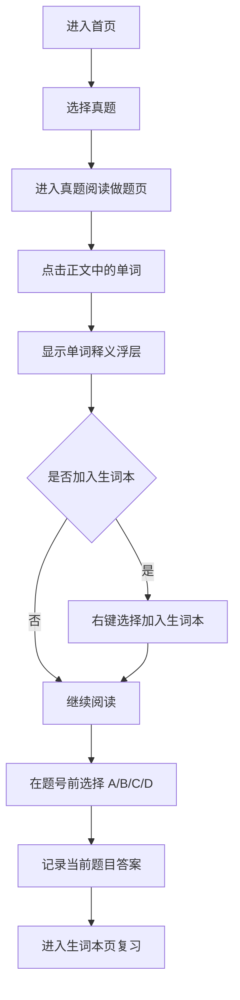

## 1. 产品概述
这是一个面向考研英语备考用户的桌面端真题阅读做题站点，核心场景是在阅读英语一真题时边做题边点词查义，并可将重点词一键加入生词本。
- 解决用户在真题训练中“遇词要切页面查、做题和积词割裂、答案记录不直观”的问题，让阅读、答题、积词在同一页面完成。
- 当前版本已接入 `2010-2019` 年英语一阅读真题与红宝书词库，优先完成“点击单词查义 + 右键加词 + 题号前选答案”这一高频学习链路。

## 2. 核心功能

### 2.1 用户角色
| 角色 | 注册方式 | 核心权限 |
|------|----------|----------|
| 普通访客 | 免登录进入 | 浏览真题列表、进入做题页、点击单词查义、选择答案 |
| 学习用户 | 本地持久化或登录 | 在普通访客能力基础上，保存生词本、记录做题选择、查看积累结果 |

### 2.2 功能模块
1. **首页 / 真题列表页**：展示年份、题型标签以及进入整年阅读真题的入口。
2. **真题阅读做题页**：展示同一年内 `Text 1-4` 阅读切换、文章、题目、选项、点击查词浮层、右键菜单、答案选择状态。
3. **生词本页**：展示已收藏词汇、释义、来源真题与移除操作。

### 2.3 页面明细
| 页面名称 | 模块名称 | 功能说明 |
|-----------|-----------|-----------|
| 首页 / 真题列表页 | 顶部导航区 | 展示站点名称、真题入口、生词本入口 |
| 首页 / 真题列表页 | 真题筛选区 | 按年份、卷别、题型进行筛选与快速定位 |
| 首页 / 真题列表页 | 真题卡片区 | 展示真题标题、年份、阅读篇数、进入按钮 |
| 真题阅读做题页 | 顶部信息栏 | 展示当前真题名称、阅读篇章、进度、返回列表 |
| 真题阅读做题页 | 篇章切换区 | 在 `Text 1-4` 之间切换，并显示每篇作答进度 |
| 真题阅读做题页 | 阅读正文区 | 按段落展示英文文章，支持逐词点击并高亮当前词 |
| 真题阅读做题页 | 单词释义浮层 | 点击单词后展示词义、词性、音标、例句或真题语境 |
| 真题阅读做题页 | 右键快捷菜单 | 在已点击单词上右键后显示“加入生词本”等操作 |
| 真题阅读做题页 | 题目作答区 | 每道题题号前提供 A、B、C、D 四个可选答案，支持切换 |
| 真题阅读做题页 | 联动反馈区 | 当前题目选中态、当前单词收藏态、操作提示反馈 |
| 生词本页 | 生词列表区 | 展示单词、释义、来源真题、加入时间 |
| 生词本页 | 搜索过滤区 | 按单词、来源年份、是否已掌握进行筛选 |
| 生词本页 | 操作区 | 支持删除、标记已掌握、回看来源真题 |

## 3. 核心流程
用户进入首页后先选择年份真题，再进入阅读做题页。在做题页中，用户可在同一年内切换 `Text 1-4`；阅读时点击单词查看中文意思，若该词值得积累，可通过右键菜单加入生词本。同时，用户可以在每道题题号前直接勾选 A、B、C、D 中的一个答案，系统实时记录当前选择。完成阅读后，用户可进入生词本复习已收藏词汇。

## 4. 用户界面设计
### 4.1 设计风格
- 主色：深墨绿、米白、低饱和金色，形成“纸张阅读 + 学习工具”气质。
- 按钮样式：轻描边圆角按钮，选中态使用深色填充与明确对比。
- 字体与字号：英文阅读区使用有书卷感的衬线字体，中文界面与说明使用清晰的无衬线字体；强调阅读舒适与信息层级。
- 布局风格：桌面端双栏布局，左侧阅读正文，右侧题目与答题区，顶部保留轻量导航。
- 图标风格：克制的线性图标，搭配细腻悬浮阴影与纸张纹理背景。

### 4.2 页面设计概览
| 页面名称 | 模块名称 | UI 元素 |
|-----------|-----------|-----------|
| 首页 / 真题列表页 | 顶部导航区 | 品牌标题、真题入口、生词本按钮、悬浮反馈 |
| 首页 / 真题列表页 | 真题卡片区 | 年份标签、题型信息、简短说明、进入按钮 |
| 真题阅读做题页 | 阅读正文区 | 仿纸张容器、段落间距、逐词 hover 态、点击高亮态 |
| 真题阅读做题页 | 单词释义浮层 | 小卡片浮层、音标、词性标签、中文释义、收藏状态 |
| 真题阅读做题页 | 右键快捷菜单 | 简洁菜单层、加入生词本、取消收藏、关闭操作 |
| 真题阅读做题页 | 题目作答区 | 题号、题干、A/B/C/D 胶囊按钮、当前选择高亮 |
| 生词本页 | 生词列表区 | 分组列表、来源标签、释义说明、操作按钮 |

### 4.3 响应与适配
- 以桌面端优先设计，优先适配宽度 1280px 以上的学习场景。
- 在中等宽度屏幕下，题目区可下移为底部模块，保证阅读区仍具备足够宽度。
- 移动端不是首期重点，仅保证基础浏览可用，不追求完整交互体验。
- 点击词义浮层与右键菜单需避免遮挡正文，并在边缘自动调整位置。

### 4.4 交互细节要求
- 单词仅在正文中可点击，点击后必须有明确高亮态和可关闭的释义浮层。
- 右键操作仅对当前聚焦单词生效，避免在页面空白处误触发自定义菜单。
- 题号前的 A/B/C/D 选项必须支持单选切换，并以视觉状态直接反映当前答案。
- 生词加入后立即反馈成功状态，并避免重复收藏同一单词。
