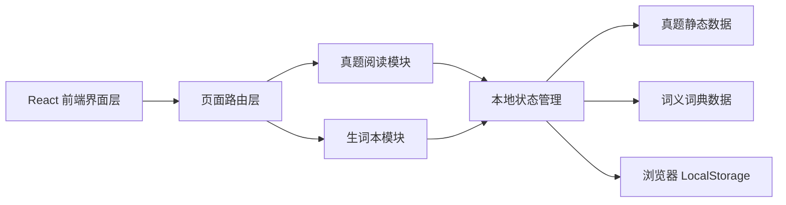
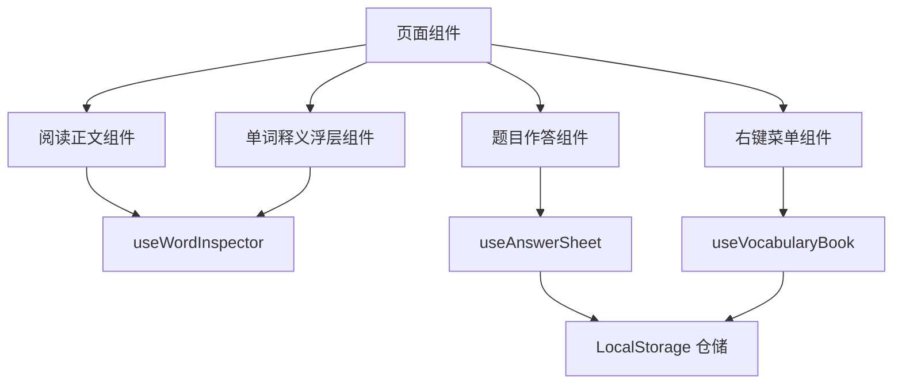
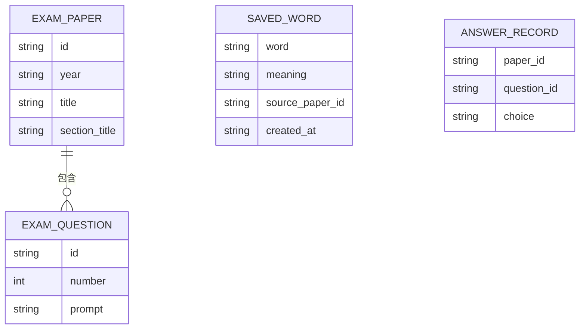

## 1. 架构设计
当前采用“React 单页前端 + 本地生成真题数据 + 浏览器本地存储”的轻量架构，真题数据来自项目内 `ZhenTi` 目录，词库来自 `word book/words.json`，不依赖后端即可完成阅读、查词与做题闭环。



## 2. 技术说明
- 前端：React 18 + TypeScript + Vite
- 样式：Tailwind CSS 3 + 自定义 CSS 变量主题
- 路由：React Router 6
- 状态管理：React Context + 自定义 hooks
- 数据来源：项目内 `ZhenTi` 原始 `doc/pdf` 通过生成脚本转换为真题 JSON，红宝书 `words.json` 转为词典数据，生词本与作答记录使用 LocalStorage 持久化
- 初始化工具：Vite

## 3. 路由定义
| 路由 | 用途 |
|------|------|
| `/` | 首页与真题列表页，展示年份筛选与真题入口 |
| `/exam/:paperId` | 真题阅读做题页，完成阅读、点词查义、右键加词、作答 |
| `/vocabulary` | 生词本页，查看已收藏词汇并做筛选管理 |

## 4. API 定义
首期不接后端接口，使用本地数据仓与统一数据访问层。若后续接入云端词库或账户系统，可沿用以下类型与仓储接口。

### 4.1 类型定义
```ts
export interface ExamPaper {
  id: string
  year: string
  title: string
  sectionTitle: string
  passages: ExamPassage[]
}

export interface ExamPassage {
  id: string
  label: string
  title: string
  paragraphs: string[]
  questions: ExamQuestion[]
}

export interface ExamQuestion {
  id: string
  number: number
  prompt: string
  options: {
    key: 'A' | 'B' | 'C' | 'D'
    text: string
  }[]
}

export interface WordDictionaryEntry {
  word: string
  phonetic?: string
  partOfSpeech?: string
  meaning: string
  source?: string
}

export interface SavedWord {
  word: string
  meaning: string
  phonetic?: string
  partOfSpeech?: string
  sourcePaperId: string
  sourcePaperTitle: string
  createdAt: string
}

export interface AnswerRecord {
  paperId: string
  questionId: string
  choice: 'A' | 'B' | 'C' | 'D'
}
```

### 4.2 数据访问接口
| 接口名 | 输入 | 输出 | 说明 |
|--------|------|------|------|
| `getExamPapers()` | 无 | `ExamPaper[]` | 获取真题列表 |
| `getExamPaperById(paperId)` | `string` | `ExamPaper \| undefined` | 获取单套真题详情 |
| `lookupWord(word)` | `string` | `WordDictionaryEntry \| undefined` | 查询单词词义 |
| `getSavedWords()` | 无 | `SavedWord[]` | 获取本地生词本 |
| `saveWord(entry)` | `SavedWord` | `SavedWord[]` | 加入生词本并去重 |
| `removeSavedWord(word)` | `string` | `SavedWord[]` | 从生词本移除 |
| `getAnswerRecords(paperId)` | `string` | `AnswerRecord[]` | 获取某套题的作答记录 |
| `setAnswerRecord(record)` | `AnswerRecord` | `AnswerRecord[]` | 设置某题当前选项 |

## 5. 前端模块架构
首期核心逻辑集中在阅读交互和本地持久化层，通过清晰的模块拆分提升后续扩展性。



## 6. 数据模型
### 6.1 数据模型定义


### 6.2 本地存储定义
```ts
export const STORAGE_KEYS = {
  savedWords: 'transword.savedWords',
  answerRecords: 'transword.answerRecords'
} as const
```

## 7. 关键交互实现说明
- 正文渲染按“段落 -> 单词 token”拆分，为每个单词包裹可点击元素，并保留原始标点显示。
- 点击单词后，`useWordInspector` 根据归一化结果查询词典，展示释义浮层并记录浮层定位。
- 右键菜单通过拦截正文单词节点的 `contextmenu` 事件触发，仅对已聚焦单词显示“加入生词本”操作。
- 生词本保存前做小写归一化与去重，避免同一单词重复加入。
- 每道题使用单选逻辑维护当前答案，题号前直接渲染 A/B/C/D 选项胶囊，切换时立即持久化到本地。

## 8. 首期实现边界
- 当前已接入 `2010-2019` 英语一阅读真题与红宝书词库。
- 词义查询仅依赖本地红宝书词典数据，不接入在线翻译或真人发音接口。
- `2020` 当前源文件为扫描版 PDF，后续需补 OCR 或替换为可复制文本源再接入。
- 首期右键菜单仅提供“加入生词本”核心操作，不扩展批注、联想词等高级功能。
- 首期答案选择仅记录用户当前选择，不提供自动判分与解析展示。
