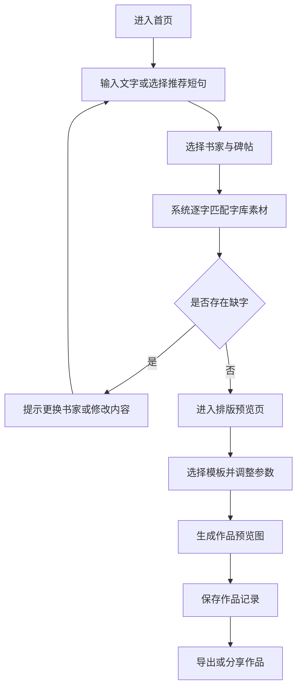

## 1. 产品概述
这是一个面向书法爱好者的微信小程序，首期聚焦“集字创作”核心场景，帮助用户快速输入短句并生成具有传统书法风格的作品预览图。
- 解决用户“找字难、拼字慢、排版麻烦、导出不方便”的问题，降低书法创作和分享门槛。
- 产品目标是先完成一个可上线验证的 MVP，优先验证集字创作的使用频率、分享意愿和字库价值。

## 2. 核心功能

### 2.1 用户角色
| 角色 | 注册方式 | 核心权限 |
|------|----------|----------|
| 普通用户 | 微信授权登录 | 输入文字、选择书家、生成集字作品、保存历史作品 |
| 游客 | 免登录浏览 | 浏览首页推荐内容，体验有限次数的集字预览 |

### 2.2 功能模块
1. **首页**：产品入口、推荐短句、热门书家、最近作品入口。
2. **集字创作页**：输入文字、选择书家或碑帖、执行逐字匹配、反馈缺字结果。
3. **排版预览页**：选择模板、调整基础参数、实时预览、导出作品。
4. **我的作品页**：查看历史作品、再次编辑、删除记录。

### 2.3 页面明细
| 页面名称 | 模块名称 | 功能说明 |
|-----------|-----------|-----------|
| 首页 | 顶部品牌区 | 展示产品名称、定位文案和主入口按钮 |
| 首页 | 推荐短句区 | 展示常用诗词、祝福语、成语，点击可直接带入创作页 |
| 首页 | 热门书家区 | 展示首期支持的书家和碑帖封面 |
| 集字创作页 | 文字输入模块 | 支持输入 2 到 12 个字，自动清理空格与非法字符 |
| 集字创作页 | 风格选择模块 | 选择书家、碑帖和模板方向 |
| 集字创作页 | 匹配结果模块 | 显示每个字的匹配状态、素材预览和缺字提示 |
| 排版预览页 | 模板切换模块 | 切换竖幅、横幅、斗方三种版式 |
| 排版预览页 | 参数调整模块 | 调整字距、行距、边距、背景色等基础参数 |
| 排版预览页 | 导出模块 | 生成作品图、保存到相册、分享好友 |
| 我的作品页 | 历史列表模块 | 展示作品缩略图、创建时间、输入内容 |
| 我的作品页 | 操作模块 | 支持再次编辑、删除和重新导出 |

## 3. 核心流程
用户进入首页后，可以直接选择推荐短句或手动输入文字；在集字创作页中选择书家与碑帖后，系统按字库逐字匹配素材，若缺字则提示更换书家或调整内容。匹配成功后进入排版页，用户选择模板并微调参数，随后生成并导出作品，同时保存到个人历史记录中。

## 4. 用户界面设计
### 4.1 设计风格
- 主色：墨黑、宣纸白、朱砂红，辅以温润灰作为辅助色。
- 按钮样式：圆角适中、轻微描边，主按钮使用深色实体，次按钮使用浅底描边。
- 字体与字号：标题采用有传统气质的中文展示字体，正文使用清晰易读的无衬线中文字体；重点控制在 4 到 5 级字号层次。
- 布局风格：卡片式信息分区，顶部留白明显，营造安静、雅致的书卷气。
- 图标风格：简洁线性图标，避免过度科技感，适合传统文化题材。

### 4.2 页面设计概览
| 页面名称 | 模块名称 | UI 元素 |
|-----------|-----------|-----------|
| 首页 | 顶部品牌区 | 大标题、宣纸纹理背景、主操作按钮、轻微淡入动画 |
| 首页 | 推荐短句区 | 横向滚动卡片、短句标签、点击反馈态 |
| 首页 | 热门书家区 | 人物卡片、碑帖封面、风格标签 |
| 集字创作页 | 输入区 | 多行输入框、剩余字数、示例占位文案 |
| 集字创作页 | 风格选择区 | 下拉选择器、标签切换、选中态边框高亮 |
| 集字创作页 | 匹配结果区 | 单字缩略图、状态标识、缺字提示卡片 |
| 排版预览页 | 预览画布区 | 宣纸背景、作品居中展示、阴影层次 |
| 排版预览页 | 调整面板 | 分段滑块、模板按钮组、实时数值反馈 |
| 我的作品页 | 作品列表 | 缩略图瀑布流或双列卡片、时间信息、操作菜单 |

### 4.3 响应与适配
- 以微信小程序移动端为主设计，优先适配常见手机宽度。
- 触控区域不小于 44px，保证滑动和点击舒适。
- 关键操作区固定在视口底部或明显位置，减少层级跳转。
- 预览画布与操作面板分层布局，避免导出按钮被内容遮挡。

### 4.4 后续扩展建议
- 第二阶段可增加单字候选替换、跨碑帖补字和题款添加。
- 第三阶段可增加 AI 评字、节日模板、高清导出和作品分享页。
