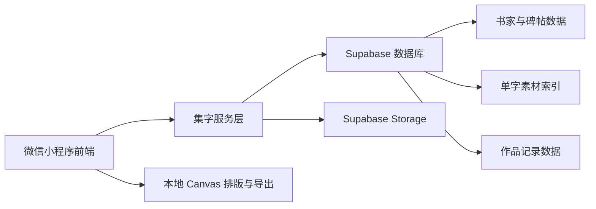
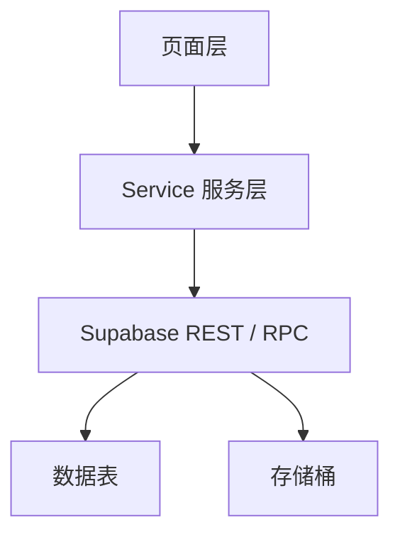
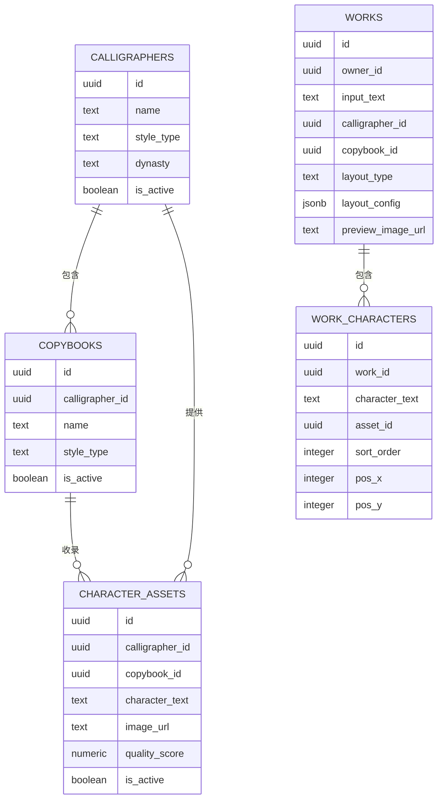

## 1. 架构设计
首期采用“微信原生小程序前端 + Supabase 云后端 + 对象存储”的轻量架构，目标是在最短周期内完成集字创作 MVP 的可用闭环。



## 2. 技术说明
- 前端：微信原生小程序 + TypeScript 风格的模块化代码组织
- 后端能力：Supabase Database + Supabase Storage + Row Level Security
- 数据访问：通过 HTTPS 接口访问 Supabase REST 能力，必要时补充轻量服务函数
- 图片合成：小程序 Canvas 负责模板排版与作品导出
- 工程组织：`miniprogram` 用于小程序代码，`supabase` 用于 SQL 与初始化配置，`.trae/documents` 用于项目文档

## 3. 页面路由定义
| 路由 | 用途 |
|------|------|
| `pages/home/home` | 首页，展示品牌入口、推荐短句和热门书家 |
| `pages/create/create` | 集字创作页，负责输入、风格选择和匹配结果展示 |
| `pages/preview/preview` | 排版预览页，负责模板切换、参数调节和导出 |
| `pages/works/works` | 我的作品页，负责历史记录展示和再次编辑 |

## 4. API 定义
以下接口基于小程序服务层封装，底层可直接调用 Supabase REST 或 RPC。

### 4.1 类型定义
```ts
export interface MatchComposeRequest {
  text: string
  calligrapherId: string
  copybookId?: string
}

export interface MatchedCharacter {
  character: string
  assetId: string
  imageUrl: string
  width: number
  height: number
  qualityScore: number
}

export interface MatchComposeResponse {
  text: string
  matched: MatchedCharacter[]
  missing: string[]
}

export interface CreateWorkRequest {
  inputText: string
  calligrapherId: string
  copybookId?: string
  layoutType: 'vertical' | 'horizontal' | 'square'
  layoutConfig: {
    charGap: number
    lineGap: number
    padding: number
    background: string
  }
  previewImageUrl?: string
}
```

### 4.2 接口清单
| 接口 | 方法 | 说明 |
|------|------|------|
| `/calligraphers` | GET | 获取书家列表 |
| `/copybooks` | GET | 按书家获取碑帖列表 |
| `/character-assets` | GET | 查询单字素材资源 |
| `/rpc/match_characters` | POST | 执行逐字匹配并返回最佳素材 |
| `/works` | POST | 创建作品记录 |
| `/works` | GET | 获取当前用户历史作品 |
| `/works/{id}` | PATCH | 更新作品配置或导出图 |
| `/works/{id}` | DELETE | 删除作品记录 |

## 5. 服务架构图
首期优先使用轻后端模式，将复杂逻辑收敛到服务层方法与数据库函数中。



## 6. 数据模型
### 6.1 数据模型定义


### 6.2 数据定义语言
```sql
create extension if not exists pgcrypto;

create table if not exists public.calligraphers (
  id uuid primary key default gen_random_uuid(),
  name text not null,
  style_type text not null,
  dynasty text,
  description text,
  cover_image_url text,
  is_active boolean not null default true,
  created_at timestamptz not null default now()
);

create table if not exists public.copybooks (
  id uuid primary key default gen_random_uuid(),
  calligrapher_id uuid not null,
  name text not null,
  style_type text not null,
  description text,
  cover_image_url text,
  source_note text,
  is_active boolean not null default true,
  created_at timestamptz not null default now()
);

create table if not exists public.character_assets (
  id uuid primary key default gen_random_uuid(),
  calligrapher_id uuid not null,
  copybook_id uuid not null,
  character_text text not null,
  image_url text not null,
  thumbnail_url text,
  width integer,
  height integer,
  bbox_top integer,
  bbox_right integer,
  bbox_bottom integer,
  bbox_left integer,
  quality_score numeric(4,2) not null default 0,
  is_active boolean not null default true,
  created_at timestamptz not null default now()
);

create table if not exists public.works (
  id uuid primary key default gen_random_uuid(),
  owner_id uuid not null,
  input_text text not null,
  calligrapher_id uuid not null,
  copybook_id uuid,
  layout_type text not null,
  layout_config jsonb not null default '{}'::jsonb,
  preview_image_url text,
  final_image_url text,
  status text not null default 'draft',
  created_at timestamptz not null default now(),
  updated_at timestamptz not null default now()
);

create table if not exists public.work_characters (
  id uuid primary key default gen_random_uuid(),
  work_id uuid not null,
  character_text text not null,
  asset_id uuid,
  sort_order integer not null,
  pos_x integer,
  pos_y integer,
  render_width integer,
  render_height integer,
  rotate_degree numeric(5,2) not null default 0,
  created_at timestamptz not null default now()
);

create index if not exists idx_copybooks_calligrapher_id
  on public.copybooks (calligrapher_id);

create index if not exists idx_character_assets_char
  on public.character_assets (character_text);

create index if not exists idx_character_assets_calligrapher
  on public.character_assets (calligrapher_id);

create index if not exists idx_character_assets_copybook
  on public.character_assets (copybook_id);

create index if not exists idx_works_owner_id
  on public.works (owner_id);

create index if not exists idx_work_characters_work_id
  on public.work_characters (work_id);
```

## 7. 权限与安全
- `calligraphers`、`copybooks`、`character_assets` 默认允许匿名只读，便于游客预览和首页展示。
- `works`、`work_characters` 仅允许登录用户访问自己的数据，使用 `owner_id = auth.uid()` 作为逻辑约束。
- 文件存储中，公开素材桶用于字库图片，私有或受控桶用于用户导出作品图。
- 服务端不会在前端暴露 `service_role_key`，前端仅使用 `anon key`。

## 8. 首期实现边界
- 仅支持 1 到 3 位书家、1 到 3 套碑帖。
- 仅支持 2 到 12 字的短句创作。
- 仅支持竖幅、横幅、斗方三种模板。
- 首期不实现 AI 评字、社区互动、商城和复杂多碑帖混搭。
