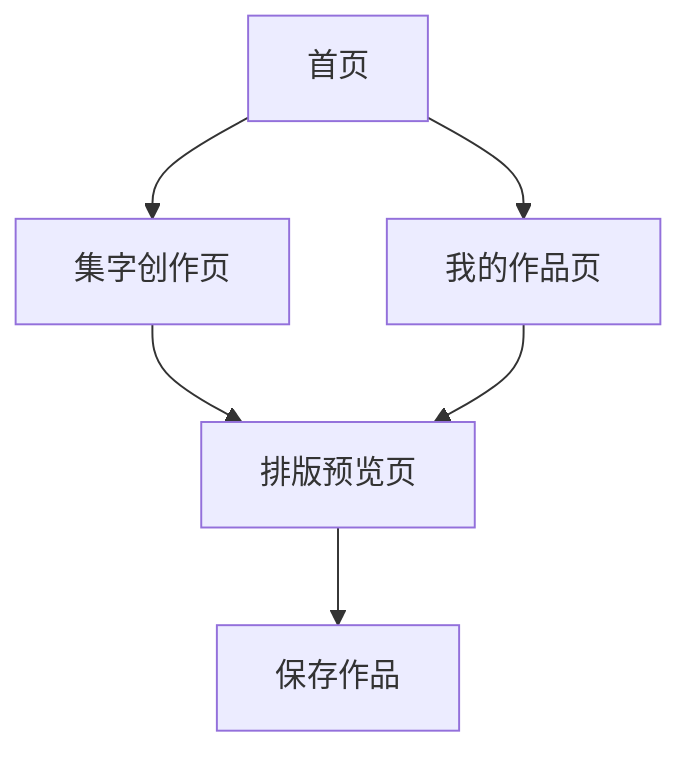

## 1. 页面清单
| 页面名称 | 页面路径 | 页面目标 |
|-----------|-----------|-----------|
| 首页 | `pages/home/home` | 建立品牌认知，提供创作入口和推荐内容 |
| 集字创作页 | `pages/create/create` | 完成文字输入、书家选择和逐字匹配 |
| 排版预览页 | `pages/preview/preview` | 完成模板切换、参数调节和作品导出 |
| 我的作品页 | `pages/works/works` | 管理历史作品并支持再次编辑 |

## 2. 信息结构

## 3. 页面布局说明

### 3.1 首页
- 顶部区域：品牌标题、副标题、主按钮“开始集字”
- 推荐内容区：推荐短句卡片，点击后直接带入创作页
- 热门书家区：书家卡片、字体标签、碑帖封面
- 最近作品入口：登录后显示最近一次作品缩略图

### 3.2 集字创作页
- 输入区：多行输入框、字数提示、示例内容快捷插入
- 风格区：书家选择、碑帖选择、模板方向选择
- 操作区：主按钮“开始匹配”
- 匹配结果区：按字符顺序展示素材图和缺字提醒

### 3.3 排版预览页
- 画布区：大面积宣纸风预览画布，居中展示作品
- 模板区：竖幅、横幅、斗方切换按钮
- 参数区：字距、行距、边距、背景样式
- 底部操作区：保存草稿、导出作品

### 3.4 我的作品页
- 作品列表：卡片展示作品缩略图、输入内容、创建时间
- 筛选区：最近作品、已导出作品
- 操作菜单：再次编辑、删除、重新导出

## 4. 组件拆分
| 组件名称 | 所属页面 | 作用 |
|-----------|-----------|------|
| `BrandHero` | 首页 | 展示品牌标题、引导文案和主按钮 |
| `PhraseCardList` | 首页 | 展示推荐短句列表 |
| `CalligrapherCard` | 首页 | 展示书家卡片信息 |
| `ComposeInputPanel` | 集字创作页 | 负责文字输入与字数校验 |
| `StyleSelector` | 集字创作页 | 负责书家、碑帖和模板选择 |
| `MatchResultGrid` | 集字创作页 | 展示匹配到的单字素材及状态 |
| `PreviewCanvas` | 排版预览页 | 负责作品预览绘制 |
| `LayoutToolbar` | 排版预览页 | 负责模板切换与参数调节 |
| `WorkCard` | 我的作品页 | 负责作品卡片展示和操作入口 |

## 5. 状态设计
| 状态名称 | 触发时机 | 页面表现 |
|-----------|-----------|-----------|
| 初始状态 | 首次进入页面 | 展示占位文案和默认推荐内容 |
| 加载状态 | 提交匹配、加载作品时 | 显示骨架屏或加载动画 |
| 成功状态 | 匹配成功、导出成功 | 展示成功提示与下一步操作 |
| 空状态 | 没有历史作品或推荐数据时 | 显示空态插画或说明文案 |
| 错误状态 | 缺字、网络异常、导出失败时 | 显示错误提示和重试按钮 |

## 6. 视觉规范
- 页面整体以宣纸白为底，卡片采用淡灰边框和轻阴影。
- 主强调色使用朱砂红，仅用于主按钮、选中态和关键提示。
- 标题层级清晰，减少花哨装饰，保持传统文化的克制感。
- 动效以淡入、平移、轻微缩放为主，不使用强烈跳动或夸张过渡。

## 7. 首期交互原则
- 所有关键动作尽量在 2 次点击内完成。
- 匹配失败要明确指出是哪一个字缺失，避免笼统报错。
- 调整参数时必须实时反馈到画布上，减少来回跳转。
- 导出前给出最终预览，导出后给出保存结果提示。
